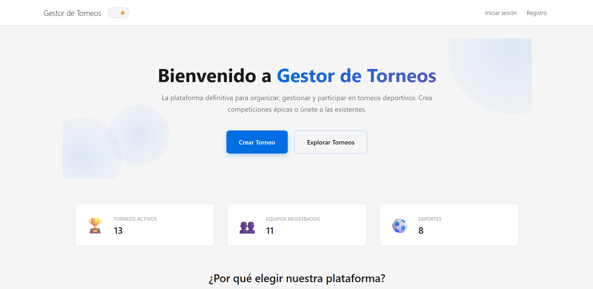

# TP DSW — Gestor de Torneos Deportivos

Repositorio central del trabajo práctico.

Gestor de Torneos es una aplicación web full stack para crear, administrar y participar en torneos deportivos, con gestión de usuarios, equipos, partidos, noticias y estadísticas.

Este repositorio funciona como **punto de entrada** para acceder al frontend, backend y documentación del proyecto.

## Repositorios del proyecto

- Frontend: https://github.com/franlovatti/Frontend_Costamagna_Gil_Lovatti_Martinez
- Backend: https://github.com/lautaromartinezz/Backend_Costamagna_Gil_Lovatti_Martinez

## Qué contiene este repo central

- Guía general del proyecto (este `README.md`)
- Documentación en la carpeta `docs/`

## Documentación

- Propuesta del TP: [docs/proposal.md](docs/proposal.md)
- Documentación de API: [docs/API.md](docs/API.md)
- Guía de tests: [docs/Test automaticos.md](docs/Test%20automaticos.md)
- Tracking de features/bugs del Back: [docs/Tracking Backend.md](docs/Tracking%20Backend.md)
- Tracking de features/bugs del Front: [docs/Tracking Frontend.md](docs/Tracking%20Frontend.md)

## Puesta en marcha rápida

1. Clonar ambos repositorios (frontend y backend).
2. Instalar dependencias en cada uno con `pnpm install`.
3. Levantar backend (por defecto en `http://localhost:3000`).
4. Levantar frontend (por defecto en `http://localhost:5173`).

Para instrucciones completas de instalación y configuración, revisar los README de cada repositorio específico.

## Integrantes

- 52241 - Costamagna Mayol, Ricardo Luis
- 52802 - Gil, Francisco Marcelo
- 52420 - Lovatti, Francisco
- 53192 - Martinez, Lautaro
