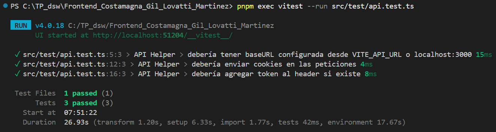
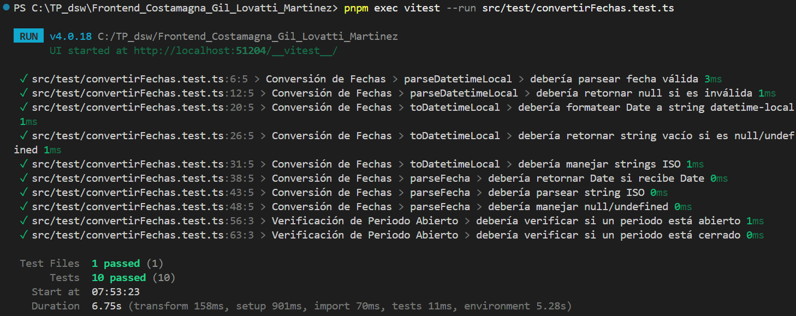
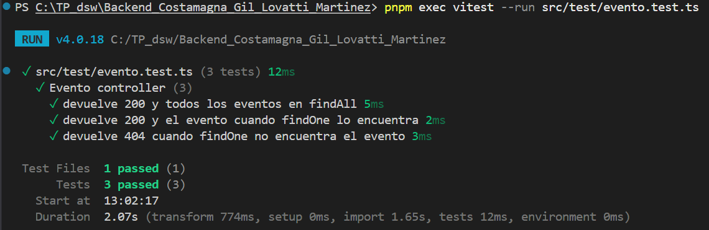
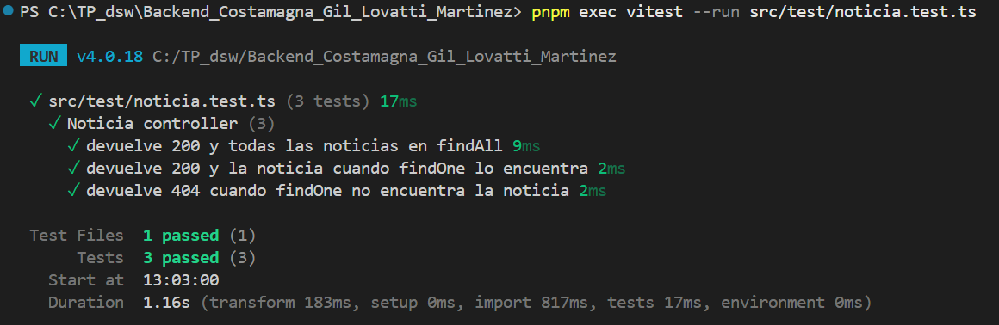
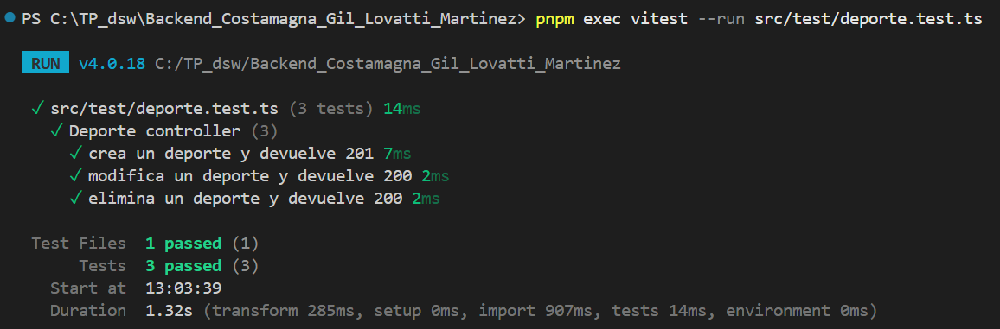
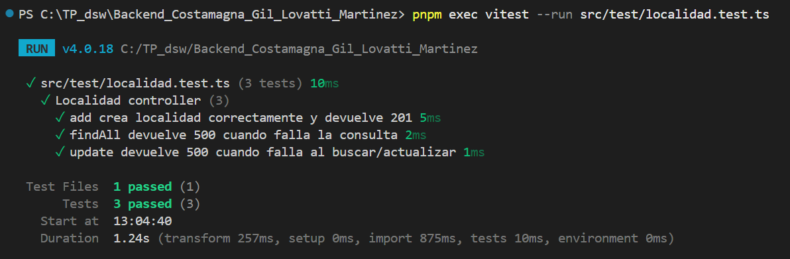
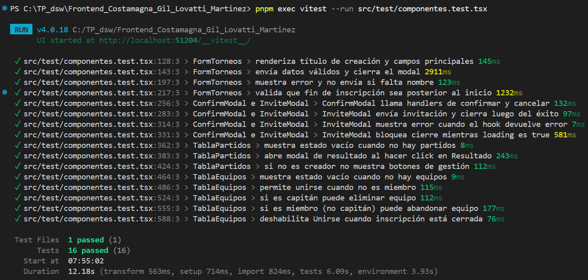
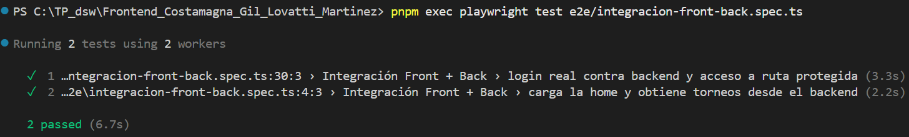
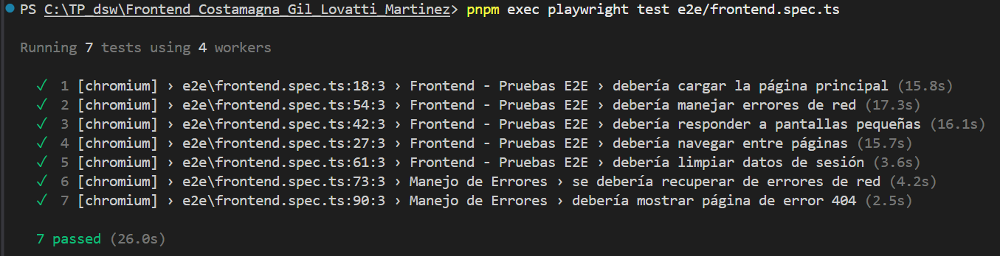
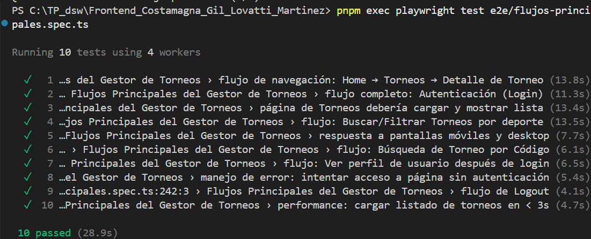

# Guía de Tests del Proyecto (Frontend + Backend)

Documento simple para ubicar **qué test existe**, **qué valida por arriba** y **cómo ejecutarlo**.

---

## 1) Tests Unitarios

### Frontend (Vitest)

#### 1. `src/test/api.test.ts`
Valida la configuración del helper API:
- `baseURL` correcta (`http://localhost:3000/api`)
- `withCredentials` en `true`
- agregado de `Authorization` cuando hay token en `localStorage`

**Comando:**
```bash
cd C:/TP_dsw/Frontend_Costamagna_Gil_Lovatti_Martinez
pnpm exec vitest --run src/test/api.test.ts
```

**Evidencia de ejecución exitosa:**


#### 2. `src/test/convertirFechas.test.ts`
Valida utilidades de fechas:
- parseo de fechas válidas/inválidas
- formato para `datetime-local`
- parseo de ISO
- verificación de período abierto/cerrado

**Comando:**
```bash
cd C:/TP_dsw/Frontend_Costamagna_Gil_Lovatti_Martinez
pnpm exec vitest --run src/test/convertirFechas.test.ts
```

**Evidencia de ejecución exitosa:**


### Backend (Vitest - tests automáticos de controladores)

#### 3. `src/test/evento.test.ts`
Valida `EventoController` (mockeando ORM):
- `findAll` exitoso (200)
- `findOne` exitoso (200)
- `findOne` no encontrado (404)

**Comando:**
```bash
cd C:/TP_dsw/Backend_Costamagna_Gil_Lovatti_Martinez
pnpm exec vitest --run src/test/evento.test.ts
```

**Evidencia de ejecución exitosa:**


#### 4. `src/test/noticia.test.ts`
Valida `NoticiaController`:
- `findAll` exitoso (200)
- `findOne` exitoso (200)
- `findOne` no encontrado (404)

**Comando:**
```bash
cd C:/TP_dsw/Backend_Costamagna_Gil_Lovatti_Martinez
pnpm exec vitest --run src/test/noticia.test.ts
```

**Evidencia de ejecución exitosa:**


#### 5. `src/test/deporte.test.ts`
Valida `DeporteController`:
- `add` crea deporte (201)
- `update` modifica deporte (200)
- `remove` elimina deporte (200)

**Comando:**
```bash
cd C:/TP_dsw/Backend_Costamagna_Gil_Lovatti_Martinez
pnpm exec vitest --run src/test/deporte.test.ts
```

**Evidencia de ejecución exitosa:**


#### 6. `src/test/localidad.test.ts`
Valida `LocalidadController` con casos mixtos:
- `add` correcto (201)
- `findAll` fallido (500)
- `update` fallido (500)

**Comando:**
```bash
cd C:/TP_dsw/Backend_Costamagna_Gil_Lovatti_Martinez
pnpm exec vitest --run src/test/localidad.test.ts
```

**Evidencia de ejecución exitosa:**


---

## 2) Tests de Componentes (Frontend)

### 7. `src/test/componentes.test.tsx`
Pruebas con Testing Library sobre componentes de UI y comportamiento:
- `FormTorneos` (render, validaciones, submit)
- `ConfirmModal` (confirmar/cancelar)
- `InviteModal` (éxito/error/loading)
- tablas y estados de componentes relacionados

**Comando:**
```bash
cd C:/TP_dsw/Frontend_Costamagna_Gil_Lovatti_Martinez
pnpm exec vitest --run src/test/componentes.test.tsx
```

**Evidencia de ejecución exitosa:**


---

## 3) Tests de Integración (Front + Back)

### 8. `e2e/integracion-front-back.spec.ts` (Playwright)
Integra frontend real + backend real:
- Home consume `GET /api/eventos`
- login real (registro + login)
- acceso a ruta protegida `/home/noticias`

**Comando:**
```bash
cd C:/TP_dsw/Frontend_Costamagna_Gil_Lovatti_Martinez
pnpm exec playwright test e2e/integracion-front-back.spec.ts
```

**Evidencia de ejecución exitosa:**


> Requisitos: backend levantado en `http://localhost:3000` y frontend en `http://localhost:5173` (Playwright levanta frontend con `pnpm dev`, pero el backend debe estar corriendo).

---

## 4) Tests Automáticos (E2E/UI)

### 9. `e2e/frontend.spec.ts`
Suite de smoke/UI general:
- carga de home
- navegación
- viewport responsive
- manejo básico de errores de red y estado

**Comando:**
```bash
cd C:/TP_dsw/Frontend_Costamagna_Gil_Lovatti_Martinez
pnpm exec playwright test e2e/frontend.spec.ts
```

**Evidencia de ejecución exitosa:**


### 10. `e2e/flujos-principales.spec.ts`
Suite amplia de flujos de negocio (login, torneos, filtros, navegación, perfil, logout, etc.).

**Comando:**
```bash
cd C:/TP_dsw/Frontend_Costamagna_Gil_Lovatti_Martinez
pnpm exec playwright test e2e/flujos-principales.spec.ts
```

**Evidencia de ejecución exitosa:**


---

## Comandos rápidos por grupo

### Frontend unitarios + componentes
```bash
cd C:/TP_dsw/Frontend_Costamagna_Gil_Lovatti_Martinez
pnpm test -- --run src/test/api.test.ts src/test/convertirFechas.test.ts src/test/componentes.test.tsx
```

### Backend automáticos (controladores)
```bash
cd C:/TP_dsw/Backend_Costamagna_Gil_Lovatti_Martinez
pnpm test:run src/test/evento.test.ts src/test/noticia.test.ts src/test/deporte.test.ts src/test/localidad.test.ts
```

### E2E completos de frontend
```bash
cd C:/TP_dsw/Frontend_Costamagna_Gil_Lovatti_Martinez
pnpm test:e2e
```

### Solo integración Front+Back (recomendado para validación rápida)
```bash
cd C:/TP_dsw/Frontend_Costamagna_Gil_Lovatti_Martinez
pnpm exec playwright test e2e/integracion-front-back.spec.ts
```

---

## Orden recomendado para correr en CI/local

1. Unitarios Front (`api` + `convertirFechas`)
2. Componentes Front (`componentes.test.tsx`)
3. Automáticos Back (`evento`/`noticia`/`deporte`/`localidad`)
4. Integración Front+Back (`integracion-front-back.spec.ts`)
5. E2E amplios (`frontend.spec.ts` y luego `flujos-principales.spec.ts`)
